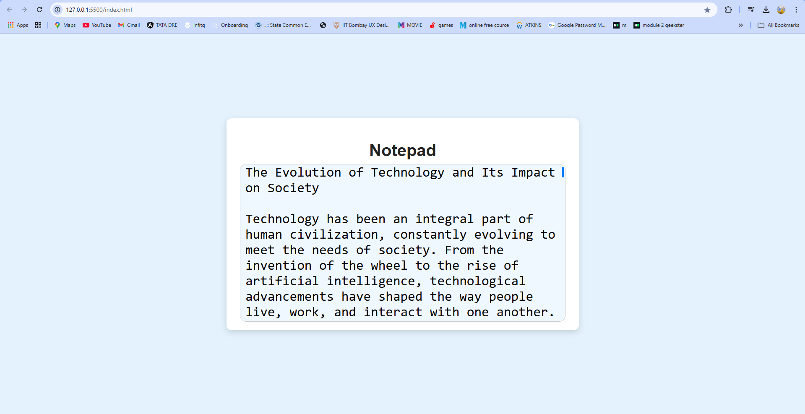

# 📝 Local Storage Project

A simple web application that features an **auto-saving textarea** where user input is **automatically stored in local storage**. This ensures that text persists even after refreshing the page.

🚀 **Live Demo:** 

[Click here to view](https://premgchavan.github.io/Local-Storage-Project/)  


## 🚀 Features
- **Auto-save functionality**: Saves text in local storage in real-time.
- **Styled UI**: A modern and minimalistic design.
- **Custom Scrollbar**: Smooth and visually appealing scrollbar.
- **Resizable Textarea**: The textarea dynamically adjusts its size along with the container.

## 🖥️ Demo Screenshot


## 🛠️ Technologies Used
- **HTML**
- **CSS** (Custom styling with smooth UI)
- **JavaScript** (Local storage functionality)

## 📂 Project Structure
```
Local-Storage-Project/
│── index.html       # Main HTML file
│── styles.css       # Styling for UI
│── script.js        # JavaScript for local storage
└── README.md        # Project documentation
```

## ⚙️ Installation & Setup
1. **Clone the repository**  
   ```bash
   git clone https://github.com/PremGChavan/Local-Storage-Project
   ```
2. **Open the project folder**  
   ```bash
   cd Local-Storage-Project
   ```
3. **Run the project**  
   - Open `index.html` in a browser.

## 🎯 How It Works
1. Start typing in the textarea.
2. Your input is automatically saved in **local storage**.
3. Even if you refresh or close the browser, the text remains.


---

Made with ❤️ by [Prem Chavan](https://github.com/PremGChavan)
